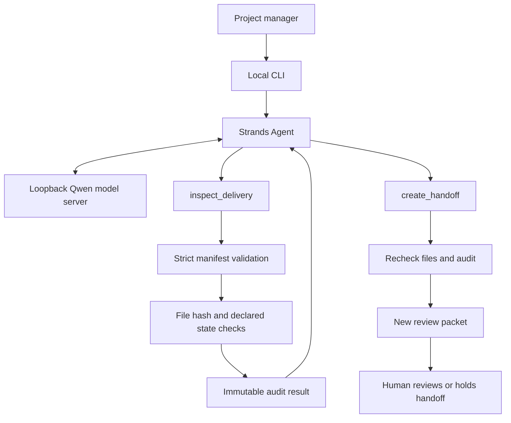

# Architecture

## Decision boundary

The model coordinates inspection and packet creation. It adds an advisory based on returned blockers.
The tools calculate the verdict and control all file access.
The model cannot choose a source path, output path, expected hash, approval, or final verdict.
Packet creation fails if the current audit differs from the inspected audit.

## Data boundary

The CLI accepts one user-selected local directory and a separate new output directory.
The model sees manifest metadata and audit results, not file contents.
Packet files include evidence content. Keep them private when they contain client material.
Both demo fixtures contain synthetic material only.

## Non-goals

This prototype does not run tests, authenticate approvals, certify a release, or send client messages.
It has no hosted service, customer database, AWS deployment, or billing integration.
It does not defend against a concurrent attacker changing filesystem paths during a run.
