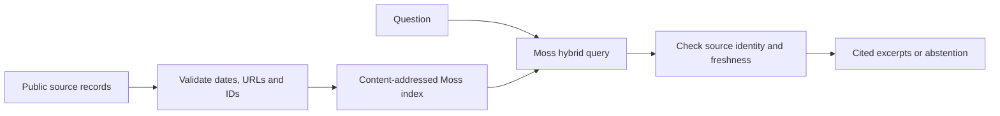

# Evidence Cache

A Moss retrieval tool that keeps expired evidence out of an agent's context.
It returns source excerpts, URLs, observation times, and expiry times as JSON.
If every retrieved source is expired or unknown, it returns `abstain`.

## Current status

The command-line core is implemented. Thirteen local tests pass, including a mocked SDK integration check.
Moss 1.9.1 imports and accepts the document and query option types used here.
Live indexing and retrieval have not run: project credentials are required.
There is no hosted app or measured Moss latency yet. This is not a contest submission.

## Setup

Use Python 3.10 or newer:

```sh
python3 -m venv .venv
. .venv/bin/activate
pip install -r requirements.txt
python -m unittest discover -s tests -v
```

Set `MOSS_PROJECT_ID` and `MOSS_PROJECT_KEY` through your secret store.
Do not put credentials into source records or commit them.
Create a free project at https://portal.usemoss.dev/auth/login after reviewing its terms.
Confirm remaining free credits before creating an index. No paid plan is required by this implementation.

Each source file is a JSON array with five fields per record:

```json
[
  {
    "id": "policy-v2",
    "text": "Synthetic example: returns are accepted for 30 days.",
    "url": "https://example.org/policy",
    "observed_at": "2026-09-09T00:00:00Z",
    "expires_at": "2026-09-10T00:00:00Z"
  }
]
```

The example is deliberately synthetic. Set real observation and expiry times before using real evidence.
An expiry is a reviewer policy, not a claim that the source is still true.

```sh
python evidence.py index --sources sources.json
python evidence.py query --sources sources.json --query 'What is the return window?'
```

Indexing uploads the supplied text and source URLs to Moss. Use public or synthetic data only.
The tool never fetches URLs, executes source instructions, or generates factual answers.
Index creation is explicit. Queries never create or overwrite an index.
Content changes produce another index name; remove old indexes through Moss after testing.
`query_ms` measures the SDK query call, excluding index loading. No speed claim is made.
Unknown IDs, duplicate results, future observations, and expired records cannot enter the returned evidence list.
The content-addressed index prevents a changed local corpus from silently querying an earlier version.

## Architecture



## Product requirement

Users: builders whose agents reuse time-sensitive documentation or eligibility rules.
Problem: semantic relevance alone can return a rule that expired yesterday.
The first release must show the source and exclude stale results before context reaches an agent.
Success means a real Moss query returns fresh excerpts and abstains on an expired-only corpus.
A hosted interface, repeatable latency benchmark, and recorded demo remain required for the hackathon package.
No wallet work, automated entry, paid services, or social-post prizes are in scope.

## Demo plan

1. Index two synthetic rules, one expired and one fresh.
2. Query their shared topic and show the fresh excerpt with its source URL.
3. Show the expired warning and the measured query-call duration.
4. Query an expired-only corpus and show abstention.
5. Explain that tests cover filtering, while live retrieval requires separate verification.

## References

- [Moss quickstart](https://docs.moss.dev/docs/start/quickstart)
- [Hackathon rules](https://yc-fall-2026-x-moss.devpost.com/rules)
