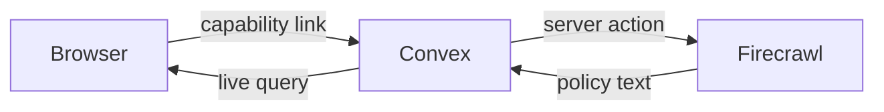

# Return Window

A shared return board for households. Track the money still in the return pile, save shop policies, and hand off the next step.

[Open the live app](https://brazen-newt-717.convex.site) · [Watch the 59-second demo](https://brazen-newt-717.convex.site/demo.mp4)

## Try it in two minutes

1. Create a board. Keep the private link; anyone with it can view, edit, and delete this board.
2. Add a clearly marked test purchase, amount, and confirmed return deadline.
3. Add a public shop policy URL. Open the purchase and select **Save policy evidence**.
4. Read the captured source text. The deadline stays unchanged; check exclusions with the shop.
5. Open the same board link in another tab. Change the return stage and watch both tabs update.
6. Download the all-day calendar reminder or copy the editable request template. The app sends no email.
7. Mark the refund received. The amount moves from the active pile to the refunded total.
8. Delete your test board. Its old link will stop working.

## Architecture

React and TypeScript run on Convex static hosting. Convex queries keep shared boards live. Mutations validate dates, amounts, link ownership, and update versions. Firecrawl runs through a server-side action and stores up to 18,000 characters of source text.



The browser creates a 256-bit random capability. The database stores its SHA-256 digest. This is link-based access, not account authentication. Do not enter sensitive receipts, addresses, payment details, or secrets. Losing the link means losing access. Sharing it grants full board control.

Concurrent saves use a version check. An older tab cannot silently overwrite a newer update. Retried purchase requests reuse an idempotency key. Board deletion removes its purchases and invalidates the link.

## Run and verify

```sh
npm ci
npx convex dev --once
npm test
npm run build
npm run dev
```

Set `VITE_CONVEX_URL` in `.env.local` to your own Convex deployment. For policy capture, set `FIRECRAWL_API_KEY` in Convex server environment settings. Never place it in a Vite variable.

```sh
npx convex deploy -y
npx @convex-dev/static-hosting upload --build --prod
```

Thirteen automated checks cover board isolation, idempotency, stale writes, deletion, invalid inputs, dates, calendar escaping, and policy capture ownership, caching, budget, and failure handling.

## Scope and limits

- Return Window was built on September 19, 2026, for Convex All Gas. Other folders in this repository are separate projects.
- Codex and the official Convex plugin assisted the build. See the repository-root `hackathon.md`.
- Firecrawl is a real integration. Runtime AI generation and AgentMail are not implemented.
- Each board supports 100 purchases. The public demo permits 100 policy capture attempts in total, with one attempt per item per minute. Captures use free credits.
- Captured text is a dated copy, not a guarantee of eligibility. The user supplies the final deadline. Shop rules can change.
- Refund totals reflect the stages you record. No bank or merchant confirms them.
- Calendar reminders require importing the downloaded file into your calendar. The app does not send notifications.
