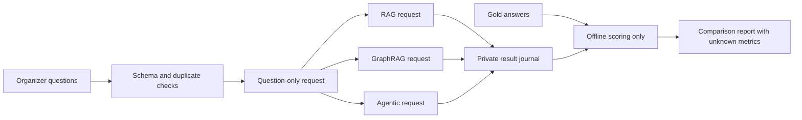

# TigerGraph investigation bench

A sequential comparison runner for the TigerGraph Agentic GraphRAG challenge. It keeps evaluation answers away from model requests, preserves response evidence, and flags baseline routing changes.

**Status: tested client checkpoint, not a complete contest entry.** No live TigerGraph answers or benchmark scores have been measured. This runner uses the upstream engines; it is not an original orchestrator yet. The original adaptive investigation layer, corpus ingestion, semantic evaluation, token instrumentation, visual dashboard, and demo remain unfinished.

## Run locally

Python 3.11 or newer. No third-party Python dependencies.

```sh
cd tigergraph-investigation-bench
python3 -m unittest discover -s tests -v
python3 fetch_questions.py
python3 bench.py validate data/eval_public.jsonl
python3 bench.py validate data/eval_hidden.jsonl
```

The organizer files checked September 9 contain 100 public questions with answers and 50 hidden questions without answers. They cover Olympic events. Files stay gitignored; the source URLs and byte hashes are in `dataset-manifest.json`. Recheck changed files before changing these hashes. Downloading questions does not register an entrant.

## Connect a no-charge runtime

First provision the organizer's free TigerGraph environment and ingest its corpus with the upstream GraphRAG service. Keep the same corpus, graph, model, and retrieval settings across runs. Use a graph-scoped account and free model capacity. The cloud database address alone is not the GraphRAG service URL.

Supply these through secure runtime credentials, not source control:

- `TG_GRAPHRAG_URL`: HTTPS root of the deployed GraphRAG API, including any reverse-proxy prefix.
- `TG_GRAPH`: graph name containing the organizer corpus.
- `TG_USERNAME`, `TG_PASSWORD`: credentials accepted by that GraphRAG service.

```sh
mkdir -p results
python3 bench.py run data/eval_public.jsonl --limit 1 --output results/smoke.jsonl --confirm-free-runtime
python3 bench.py report results/smoke.jsonl
```

The default is one question and three sequential requests. Explicitly increase `--limit` only after checking free capacity. There are no automatic retries. A timeout does not cancel server-side model work. On failure, prior rows survive. Use a new output filename to retry; existing results never get overwritten. A full public run makes 300 requests; hidden makes 150. Each request may trigger multiple internal model calls.

The client calls `POST /{graph}/query` with explicit settings:

| Label | Engine | Retrieval setting |
|---|---|---|
| rag | classic | similaritysearch |
| graphrag | classic | hybridsearch |
| agentic | agentic | planned |

These are **requested settings**, not proof of strict baselines. Upstream classic engines can route or retry internally. Agentic mode can downgrade when the model lacks tool support. The runner flags a reported classic retriever mismatch. Missing routing evidence and all agentic runs remain `unverified` until trace review. Do not report this comparison as controlled without checking actual paths and disabling unwanted fallbacks.

## Honest measurements

The output records answer text, the upstream `query_sources` object, elapsed client time, question hashes, and requested pipeline. Treat raw responses as private: they can contain corpus content or provider diagnostics. Inspect and sanitize before publication.

`exact_match_proxy` accepts normalized whole-answer equality against a public reference answer. It is deliberately strict and is not semantic accuracy. `gold_citation_recall` counts explicit Q-IDs in the answer against organizer gold document IDs. Retrieved documents are not citations. A citation ID alone does not prove the associated claim.

Semantic accuracy, completeness, and token counts remain `null`. The response envelope does not promise token usage. Do not estimate those from character counts or label missing values zero. Hidden questions have no accuracy score. The report shows scored counts and routing gaps alongside exact-match results.

## Architecture



## Finish the entry

1. Register Amaan and activate organizer credits. The listing conflicts on September 12 versus 14; use September 12 safely.
2. Connect the GraphRAG runtime, ingest the official corpus, and verify one question across three controlled pipelines.
3. Build an original evidence-driven orchestrator that stops on sufficient evidence, repeated failed actions, or a fixed budget.
4. Add provider-reported token counts and semantic judging, then run the 100 public and 50 hidden questions.
5. Produce the visual dashboard, trace walkthrough, architecture image, and demo video. Review legal terms and licensing before submission.

Registration, legal acceptance, publication of a demo, and final submission remain founder-owned. No terms or license were accepted by this build.

## Sources checked September 9, 2026

- [Official challenge](https://unstop.com/hackathons/agentic-graphrag-hackathon-tigergraph-1747871/amp)
- [Official guidebook](https://alluring-beryllium-491.notion.site/Agentic-GraphRAG-Hackathon-Guidebook-34fc2cb129c08146998af3568d7d2594)
- [Official dataset](https://drive.google.com/drive/folders/10C0hzRaHlm00VYPFbjapKtWj0EPmLvQ9)
- [Upstream API](https://github.com/tigergraph/graphrag/blob/main/graphrag/app/routers/inquiryai.py)
- [Upstream routing](https://github.com/tigergraph/graphrag/blob/main/graphrag/app/agent/agent_graph.py)

This client contains independently written code. It does not vendor upstream GraphRAG code. Deployments using that separate project must review its own license.
